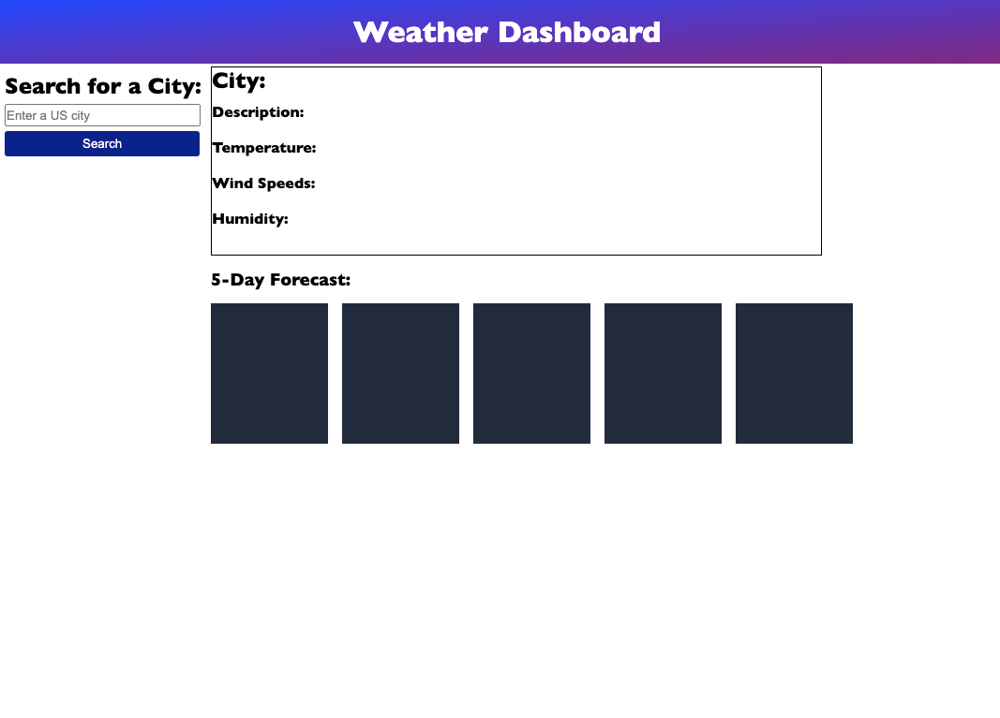

# Weather-Dashboard

## Description
- This project was to create a weather dashboard where the user can search for the weather in a US city of their request. 
- This is possible due to the weather API used for the project.
- A user can type in any city in the US and the webpage will return the forecast for the day and for 5 days out. It will include results of the temperature, wind speed, and humidity.

## Mockup

## Screenshot of Webpage

## Deployed Application
Weather Dashboard [Application]()!